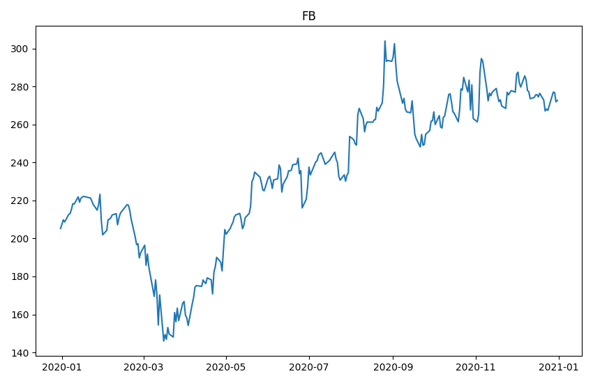
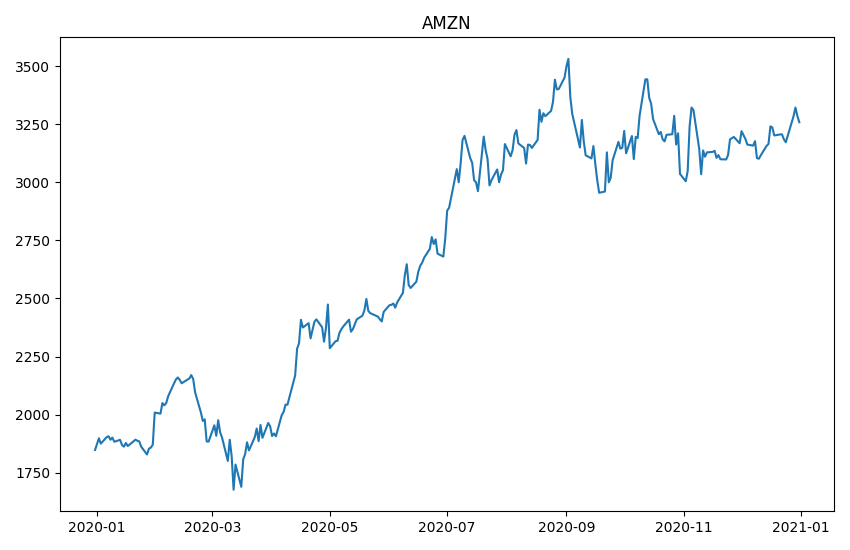
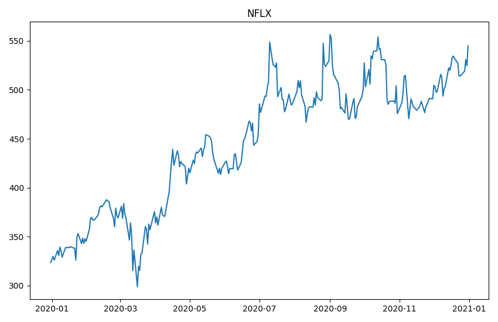
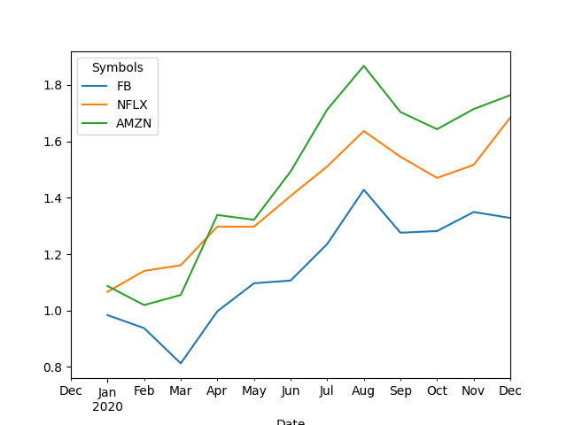

# Stock Market Analyser

This application uses pandas data reader library to fetch stock data from Yahoo-finance and performs multiple analysis on it.

The app stores the image of the adjusted close of the stock from `2020-01-01` till `2020-12-31`. As well as the comparitive line graph of the Daily Percentage Return for the whole year.

The images are stored in the directory by using the savefig function.

The app also gives the mean, covariance, standard deviation and correlation of the monthly stock returns.

```
             Welcome to stock market analyser

 You can enter stock tickers and get the Daily Percentage Change and other statitical data like MEAN, CORRELATION and COVARIANCE for the stocks that you will enter
for eg: FB NFLX AMZN

Enter the tickers : FB NFLX AMZN


```

The app takes the Stock Tickers as input and converts it into a list and then extracts data from Yahoo-Finance

```

...loading stock data


 ---- STOCK DATA ----

Attributes   Adj Close              ...   Volume
Symbols             FB        NFLX  ...     NFLX     AMZN
Date                                ...
2019-12-31  205.250000  323.570007  ...  3713300  2506500
2020-01-02  209.779999  329.809998  ...  4485800  4029000
2020-01-03  208.669998  325.899994  ...  3806900  3764400
2020-01-06  212.600006  335.829987  ...  5663100  4061800
2020-01-07  213.059998  330.750000  ...  4703200  4044900
...                ...         ...  ...      ...      ...
2020-12-24  267.399994  513.969971  ...  1144000  1451900
2020-12-28  277.000000  519.119995  ...  2891900  5686800
2020-12-29  276.779999  530.869995  ...  4022400  4872900
2020-12-30  271.869995  524.590027  ...  1874200  3200400
2020-12-31  272.649994  545.000000  ...  2563212   776577

[254 rows x 18 columns]

```

Then you can select the statistical data like Mean, Standard Deviation, Correlation, Covariance to be displayed by pressing Y

```
If you would like to print the mean of monthly stock returns if yes enter Y else press N
 :y
If you would like to print the standard deviation of monthly stock returns if yes enter Y else press N
 :y
If you would like to print the correlation of monthly stock returns if yes enter Y else press N
 :y
If you would like to print the covariance of monthly stock returns if yes enter Y else press N
 :y

 ---- Mean ----

Symbols
FB      0.028930
NFLX    0.045892
AMZN    0.052659
dtype: float64


 ---- Standard Deviation ----

Symbols
FB      0.106294
NFLX    0.057568
AMZN    0.100065
dtype: float64


 ---- Correlation ----

Symbols        FB      NFLX      AMZN
Symbols
FB       1.000000  0.479821  0.699816
NFLX     0.479821  1.000000  0.716146
AMZN     0.699816  0.716146  1.000000


 ---- Covariance ----

Symbols        FB      NFLX      AMZN
Symbols
FB       0.011298  0.002936  0.007443
NFLX     0.002936  0.003314  0.004125
AMZN     0.007443  0.004125  0.010013

```






```

The Images has been stored in the working directory.

Have a nice day :)

```
